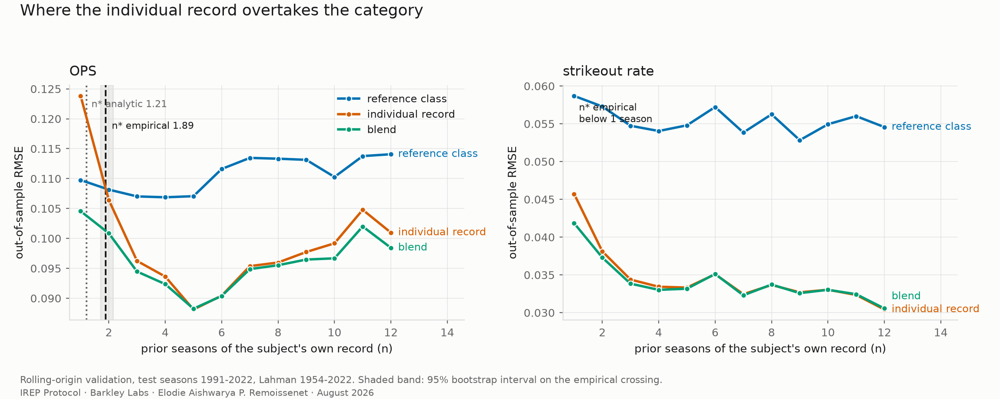
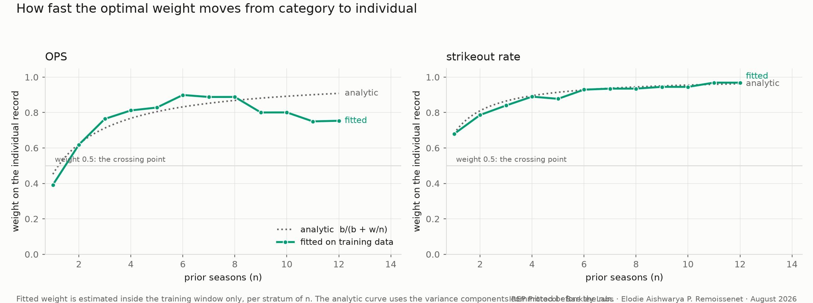

# The Crossing Point

[](https://doi.org/10.5281/zenodo.22125147)

At what amount of individual evidence does a subject's own record beat their
reference class, and how far is that point from what classical shrinkage theory
predicts.

A real-data test of the individual-referential thesis behind
[IREP](https://irepprotocol.org), on the Lahman Baseball Database.

**Status: pilot.** The baseball run generates the hypotheses; the confirmatory
test is a second domain with a different noise structure. See
[`PREREGISTRATION.md`](PREREGISTRATION.md) section 0, which says so first rather
than last. Post-pilot corrections, all bug fixes and none of them hypothesis
changes, are dated in [`AMENDMENTS.md`](AMENDMENTS.md) with their measured
effects.

## Run it

```
python run.py
```

Downloads the database (69 MB, checksum pinned), builds the panel, commits the
analytic prediction, runs everything out-of-sample, then runs the sensitivity
analyses. Needs numpy and matplotlib; the database is read with the standard
library.

## What it measures

Two estimators predict a player's next season:

- **the reference class**: the mean of other players sharing their age bucket,
  position and playing-time tier, the subject's own seasons excluded. The
  resume.
- **the individual record**: the exposure-weighted mean of their own prior
  seasons. Cohort membership discarded, including age.

and a Marcel-class blend of the two, with the weight fitted inside the training
window only.

Under squared loss the two cross where sigma2_w / n = sigma2_b, so

> n\*_analytic = sigma2_w / sigma2_b

and the reliability of the individual mean at that n is exactly 0.5. **The
crossing point and the optimal shrinkage weight are one object.** That is
classical, and the specification concedes it in section 2 rather than waiting
for a reviewer to. What is not classical is how far the measured crossing sits
from that prediction once real noise structure is allowed in, and why.

## Result

Rolling-origin validation, 32 origins, test seasons 1991-2022, 11,568 test
cases per metric. Intervals are a cluster bootstrap over subjects.

| metric | n\*_analytic | n\*_empirical | 95% CI | in prior plate appearances |
|---|---|---|---|---|
| OPS | 1.21 seasons | **1.89 seasons** | [1.71, 2.15] | 511 |
| strikeout rate | 0.47 seasons | **below 1 season** | censored at the smallest observable n | 183 or fewer |

**The pre-registered direction held wherever it could be measured.** H3 said
the empirical crossing would sit later than the analytic one. For OPS it does,
in the pooled result and in every era window tested (+0.28 to +0.47
era-matched). For the strikeout rate the crossing is censored below one season
in every variant, which is consistent with H3 but cannot confirm it: there is
nothing to measure above the boundary. A stable skill simply belongs to the
individual from the first season observed.

**The pooled gap is a sum of mechanisms, not one.** The headline +0.68 for OPS
decomposes under the sensitivity analyses (`out/sensitivity.json`; these are
one-factor-at-a-time probes and overlap, so they do not add to exactly +0.68):

| rival explanation | probe | contribution |
|---|---|---|
| drift in sigma2_w / sigma2_b between the 1954-1990 fit window and the 1991-2022 test window | refit the analytic value on the test era itself (post hoc): 1.55, not 1.21 | roughly +0.34 of the gap |
| the conditioned reference class | same crossing against the unconditioned grand mean: 1.80 vs 1.89 | roughly +0.09 |
| the remainder | the individual estimator itself under-performs the sigma2_w(1+1/n) law at high n, where ageing makes a long record over-weight a player's peak | the rest |

An earlier version of this README attributed the whole gap to the
reference-class conditioning. The pipeline's own probes measure that mechanism
at about an eighth of the total, and the attribution was withdrawn; the
direction of H3 survives era-matching, the single-mechanism story does not.

**The crossing is an upper bound, and it is floor-conditional.** Relaxing the
exposure floor on the outcome season only (everything else as shipped) moves
the crossing monotonically from 1.89 down to 1.44 at a 1-PA outcome floor, on
the squared-error basis too, so it is censoring and not noise: the subjects
censored out are ones the individual record predicts better. And the gap
itself scales with the exposure floor, because sigma2_w carries sampling noise
proportional to 1/PA: gap +0.69 / +0.68 / +0.36 / +0.25 at floors 50 / 100 /
200 / 300. Quote the crossing with its floor or not at all.

**n\* tracks signal-to-noise within this sport.** A fast-stabilising rate
crosses below one season; a slow composite takes nearly two. Whether that
holds across domains, which is the transferable claim, is exactly what the
second domain is for; two metrics in one sport cannot establish it.

**The weight curve breaks from theory where the subject drifts.** For the
strikeout rate the fitted blend weight tracks the analytic reliability curve
across the whole range. For OPS it tracks it to n = 8 and then falls away,
0.89 to 0.75 by n = 11, while the analytic curve keeps rising: a long record
over-weights a veteran's peak once ageing sets in. The classical model has no
term for that, and this is where it shows. The playing-time tier
operationalisation, whose absolute cuts degenerate for the 2021 test season
because 2020 was a 60-game season, moves the crossing by 0.005: nothing rests
on it.





## Read before quoting anything

[`LIMITATIONS.md`](LIMITATIONS.md). In particular: the crossing is an upper
bound under outcome censoring, with one in ten at-risk subjects outside the
sweep entirely; the gap is floor-conditional; ageing sits inside the
within-subject variance term and inflates the analytic prediction; and the
quantity here is **not** the sabermetric stabilisation point, which is computed
within a season and excludes genuine year-to-year change. No published
stabilisation figure is quoted in this repository, deliberately.

## Layout

```
run.py                  one command, stages in pre-registration order
src/panel.py            player-season panel, every dropped row counted
src/variance.py         variance components, the committed analytic prediction
src/validate.py         three estimators, rolling-origin validation, cluster bootstrap
src/figures.py          the two figures
src/sensitivity.py      the five rival-explanation probes
PREREGISTRATION.md      hypotheses, frozen for the second domain
AMENDMENTS.md           every post-pilot correction, dated, with its effect
LIMITATIONS.md          written alongside the code, not after
out/                    panel, results, sensitivity, figures
```

## Cite

See [`CITATION.cff`](CITATION.cff). Software DOI: [10.5281/zenodo.22125148](https://doi.org/10.5281/zenodo.22125148) (this release); [10.5281/zenodo.22125147](https://doi.org/10.5281/zenodo.22125147) (all versions, always resolves to the latest).

## Data

Lahman Baseball Database, 1871-2022 build, CC BY-SA 3.0, donated by Sean Lahman
to SABR. Analysis window 1954 onward: sacrifice flies, required by the OBP
denominator, were first recorded that year. The current SABR release includes
the 2025 season; the build pinned here ends at 2022, which changes nothing
methodological but should not be described as current.
